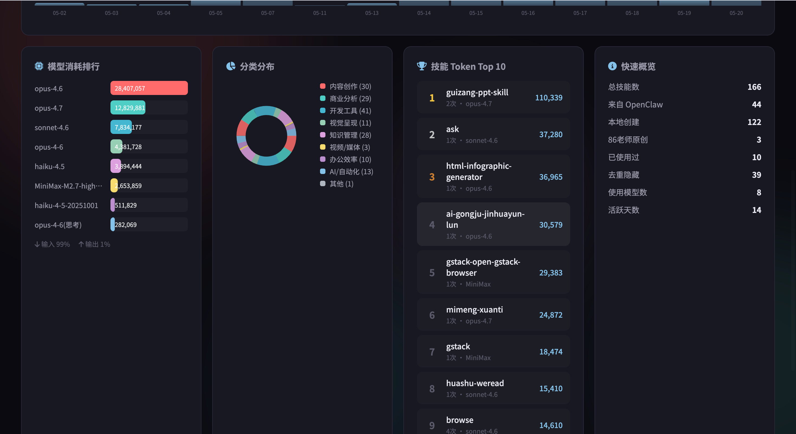
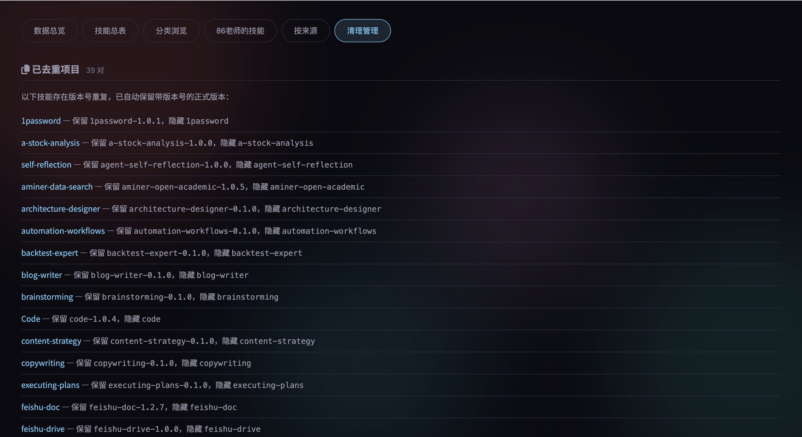

# Skill Dashboard

一个用 Claude Code 半天做出来的本地 Skill 看板：把 `~/.claude/skills` 里的 `SKILL.md` 扫描出来，整理成可搜索、可筛选、可复制调用语句的网页控制台。

> 核心目标不是“再做一个管理系统”，而是让 Claude Code 里的 skills 从一堆文件，变成真正看得见、找得到、用得起来的能力资产。


## 为什么做这个

我一直在用 Claude Code 做产品开发和知识管理，也在不断安装、创建、改造各种 skills。skills 多起来以后，问题非常现实：

- 装了很多 skill，但用的时候想不起来。
- 知道有这个能力，却忘了准确名字和调用方式。
- `SKILL.md` 都在目录里躺着，但没有一个面板告诉我“我到底有什么武器”。
- skills 本来是为了减少重复劳动，可入口不可见时，它们自己也会变成新的信息债。

所以我花了大概半天时间，用 Claude Code 做了这个 Skill Dashboard。

它先服务我自己的 Claude Code 工作流：

> 我现在到底装了哪些 skills？它们什么时候该用？哪个最近用过？能不能一键复制调用语句？

后面才顺手兼容 Codex、插件缓存、项目目录等其他 skill 来源。换句话说：这是一个从 Claude Code 使用场景长出来的小工具，不是为了 Codex 做的。

## 功能

- 默认扫描 Claude Code skills：`~/.claude/skills`
- 可选扫描 Codex / 插件缓存 / 项目目录等其他 skill 来源
- 解析 `SKILL.md` frontmatter 和正文描述
- 按 skill 名称和描述去重，合并多处安装副本
- 统计来源：Claude、Codex、Plugin、Project
- 从本地 Chronicle / Claude memory 数据库里估算使用次数
- 显示最近出现时间、版本、副本数量
- 搜索名称、用途、路径、触发词
- 按来源筛选
- 按使用次数或名称排序
- 一键复制调用语句：`使用 $skill-name 帮我处理：`
- 一键复制 skill 目录



## 页面细节

每个 skill 会被整理成一张卡片：用途、人话版触发场景、版本、副本数量、最近出现时间、来源路径和复制按钮都放在一起。重点是降低从“看到 skill”到“真正调用 skill”的摩擦。




## 适合谁

- 主要使用 Claude Code，并且安装了很多 skills 的人
- 经常自己写 `SKILL.md`、改 skill、迁移 skill 的人
- 想把 Agent 能力资产可视化的人
- 想知道哪些 skill 真的被用过，哪些只是躺在硬盘里吃灰的人
- 同时使用 Claude Code / Codex / OpenClaw / Obsidian Agent，但希望有一个统一入口的人

## 技术栈

- Next.js 16
- React 19
- TypeScript
- 本地文件系统扫描
- SQLite 读取使用记录（可选）

## 快速开始

```bash
pnpm install
pnpm dev
```

打开：

```text
http://localhost:3000
```

构建：

```bash
pnpm build
```

类型检查：

```bash
pnpm lint
```

## 默认扫描目录

Claude Code 是第一优先级：

```text
~/.claude/skills
```

同时也会尝试扫描这些可选位置，目录不存在会自动跳过：

```text
~/.codex/skills
~/.codex/plugins/cache/openai-bundled
~/.codex/plugins/cache/openai-curated
~/.codex/plugins/cache/openai-primary-runtime
~/ljg-skills/skills
~/.openclaw/workspace/skills
~/.agents/skills
```

使用记录会尝试读取：

```text
~/.claude-mem/claude-mem.db
```

没有这个数据库也可以正常使用，只是“使用次数”和“最近出现”会为空。

## 设计取向

界面没有走常见的 SaaS 白底卡片，而是做成了一个偏“控制台 / 仪表盘 / 黑金档案馆”的视觉：

- 深色背景，降低长时间浏览疲劳
- 金色强调，突出高频调用和核心指标
- 三列卡片，优先让你扫全局，而不是逐个点开
- 复制按钮放在每张卡片底部，减少从“看到 skill”到“调用 skill”的摩擦

## 一句话介绍

Skill Dashboard 是一个给 Claude Code power user 用的本地 skill 资产面板：把散落的 `SKILL.md` 变成可搜索、可筛选、可复制调用的操作台。

## License

MIT
