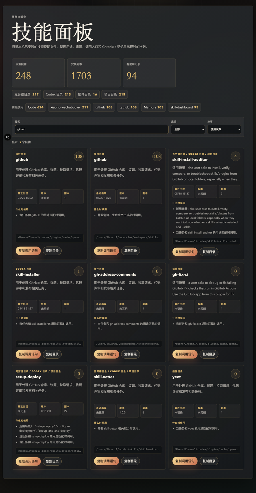

# Skill Dashboard

一个本地优先的 Agent Skill 看板：扫描你电脑里的 `SKILL.md`，把散落在 Claude Code、Codex、插件缓存和项目目录里的 skills 统一变成一个可搜索、可筛选、可复制调用语句的网页面板。


## 为什么做这个

我在同时使用 Claude Code、Codex、OpenClaw、Obsidian 里的 Agent 插件，也在不断安装和改造各种 skills。问题很快就出现了：

- skill 装得越多，越记不住“到底有什么能力”。
- 同一个 skill 可能在 Claude、Codex、插件缓存里有多个副本。
- 真到要用的时候，经常不是不会做，而是不知道该调用哪个 skill。
- skills 本来是为了降低重复劳动，但如果入口不可见，它们自己也会变成一堆新的信息债。

所以我花了大概半天时间做了这个小看板。

它不是一个宏大的平台，也不是又一个复杂的 Agent 框架。它只解决一个很朴素的问题：

> 我现在到底装了哪些 skills？它们什么时候该用？我能不能一键复制调用语句？

## 功能

- 自动扫描本机多个 skill 目录
- 解析 `SKILL.md` frontmatter 和正文描述
- 按 skill 名称去重，合并多处安装副本
- 统计来源：Claude、Codex、Plugin、Project
- 从本地 Chronicle / Claude memory 数据库里估算使用次数
- 显示最近出现时间、版本、副本数量
- 搜索名称、用途、路径、触发词
- 按来源筛选
- 按使用次数或名称排序
- 一键复制调用语句：`使用 $skill-name 帮我处理：`
- 一键复制 skill 目录



## 适合谁

- 同时使用 Claude Code / Codex / OpenClaw / Obsidian Agent 的人
- 经常安装、迁移、修改 skills 的人
- 想把自己的 Agent 能力资产可视化的人
- 想知道哪些 skill 真的被用过，哪些只是躺在硬盘里吃灰的人

## 技术栈

- Next.js 16
- React 19
- TypeScript
- 本地文件系统扫描
- SQLite 读取使用记录（可选）

## 快速开始

```bash
pnpm install
pnpm dev
```

打开：

```text
http://localhost:3000
```

构建：

```bash
pnpm build
```

类型检查：

```bash
pnpm lint
```

## 默认扫描目录

当前会扫描这些位置：

```text
~/.claude/skills
~/.codex/skills
~/.codex/plugins/cache/openai-bundled
~/.codex/plugins/cache/openai-curated
~/.codex/plugins/cache/openai-primary-runtime
~/ljg-skills/skills
~/.openclaw/workspace/skills
~/.agents/skills
```

如果目录不存在，会自动跳过。

使用记录会尝试读取：

```text
~/.claude-mem/claude-mem.db
```

没有这个数据库也可以正常使用，只是“使用次数”和“最近出现”会为空。

## 设计取向

界面没有走常见的 SaaS 白底卡片，而是做成了一个偏“控制台 / 仪表盘 / 黑金档案馆”的视觉：

- 深色背景，降低长时间浏览疲劳
- 金色强调，突出高频调用和核心指标
- 三列卡片，优先让你扫全局，而不是逐个点开
- 复制按钮放在每张卡片底部，减少从“看到 skill”到“调用 skill”的摩擦


## 一句话介绍

Skill Dashboard 是一个给 Agent power user 用的本地 skill 资产面板：把散落的 `SKILL.md` 变成可搜索、可筛选、可复制调用的操作台。

## License

MIT
